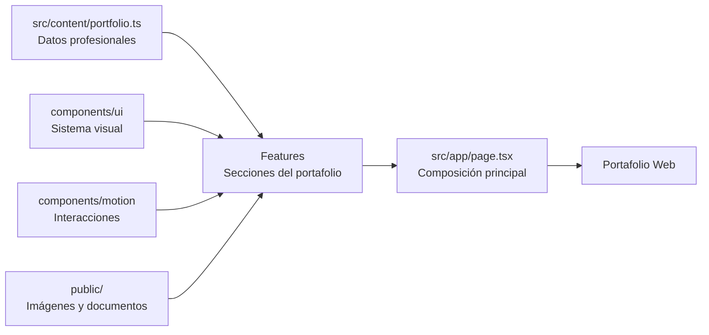

<p align="center">
  
</p>

<p align="center">
  
</p>

<p align="center">
  
  
  
  
</p>

<br />

## Sobre este proyecto

Este repositorio contiene mi **portafolio web profesional**, diseñado para presentar de forma clara mi perfil en **Redes, Soporte Técnico y Ciberseguridad**, junto con mi experiencia, formación, habilidades y proyectos.

El objetivo no es funcionar como una plantilla para descargar, sino como una **presentación técnica y visual de mi trabajo**: qué he realizado, qué tecnologías manejo y cómo fue construido el propio portafolio.

> El contenido profesional se mantiene separado de la interfaz para que la información pueda evolucionar sin romper la estructura visual del sitio.

---

## Qué presenta el portafolio

| Sección | Contenido |
| :--- | :--- |
| **Hero** | Presentación principal, especialidad y accesos rápidos. |
| **Sobre mí** | Perfil profesional y enfoque actual. |
| **Experiencia** | Trabajo realizado en soporte TI, mantenimiento y redes. |
| **Formación** | Universidad, cursos y certificaciones técnicas. |
| **Habilidades** | Herramientas y tecnologías relacionadas con soporte, redes y sistemas. |
| **Proyectos** | Casos prácticos con descripción, tecnologías, evidencias e imágenes. |
| **Contacto** | GitHub, LinkedIn, correo y acceso al CV. |

---

## Cómo fue construido

El portafolio se desarrolló con una arquitectura modular para mantener separadas la **presentación**, la **lógica de cada sección** y la **información profesional**.

```text
portafolio-v0/
│
├── src/
│   ├── app/                 → rutas y composición de páginas con Next.js
│   ├── components/
│   │   ├── motion/          → animaciones y componentes interactivos
│   │   ├── shared/          → navegación, tema e iconografía
│   │   └── ui/              → componentes visuales reutilizables
│   │
│   ├── content/
│   │   └── portfolio.ts     → datos del perfil, experiencia y proyectos
│   │
│   ├── features/
│   │   ├── portfolio/       → hero, about, experiencia, educación y skills
│   │   ├── projects/        → tarjetas, enlaces y modal de proyectos
│   │   ├── contact/         → sección de contacto
│   │   └── blog/            → soporte para contenido MDX
│   │
│   └── lib/                 → utilidades compartidas
│
├── public/
│   ├── documents/           → CV
│   ├── institutions/        → recursos visuales de instituciones
│   └── projects/            → capturas y evidencias de proyectos
│
└── content/                 → contenido MDX
```

### Flujo de la aplicación



---

## Experiencia visual

El diseño del sitio busca mantener una estética profesional y tecnológica sin sobrecargar la interfaz.

- **Diseño responsive** para escritorio y dispositivos móviles.
- **Tema claro y oscuro** mediante `next-themes`.
- **Animaciones de entrada** y transiciones con Framer Motion.
- **Blur Fade** para revelar contenido de forma progresiva.
- **Dock de navegación flotante** para accesos rápidos.
- **Tarjetas reutilizables** para experiencia, educación y proyectos.
- **Modales de proyectos** con descripción ampliada, tecnologías y evidencias.
- **Iconografía dinámica** con Iconify, Lucide y React Icons.
- **Contenido estructurado** para evitar mezclar datos profesionales con componentes visuales.

---

## Stack tecnológico

<p align="center">
  
</p>

| Tecnología | Uso dentro del proyecto |
| :--- | :--- |
| **Next.js** | App Router, rutas y estructura general del portafolio. |
| **React** | Construcción de componentes y composición de la interfaz. |
| **TypeScript** | Tipado de datos, componentes y estructuras del proyecto. |
| **Tailwind CSS** | Sistema de estilos responsive y diseño visual. |
| **Framer Motion / Motion** | Animaciones, transiciones y microinteracciones. |
| **Radix UI** | Base accesible para componentes de interfaz. |
| **Iconify / Lucide / React Icons** | Sistema de iconos para tecnologías y navegación. |
| **next-themes** | Gestión de tema claro y oscuro. |
| **MDX / React Markdown** | Base para contenido técnico y publicaciones. |
| **Shiki / Rehype** | Preparación para renderizado de contenido técnico con código. |

---

## Proyectos presentados

El portafolio no se limita a mostrar tecnologías: incluye proyectos con contexto, problema abordado, implementación y evidencias.

| Proyecto | Enfoque | Tecnologías principales |
| :--- | :--- | :--- |
| **Mesa de ayuda con GLPI** | Gestión de incidencias y soporte TI | GLPI, Ubuntu, Apache, MariaDB, PHP |
| **Monitoreo de Windows y alertas** | Automatización y observabilidad | PowerShell, Windows, CIM, Discord |
| **Red segmentada con VLAN** | Redes empresariales y control de acceso | Cisco IOS, EVE-NG, VLAN, DHCP, ACL, SNMP |
| **Sistema de gestión de inventario** | Aplicación académica de escritorio | Java, Swing, Apache Ant, patrones de diseño |
| **Mundo Electrónico** | Catálogo web comercial | Next.js, React, TypeScript, Tailwind, Vercel |

Las tarjetas de proyectos muestran capturas reales almacenadas en `public/projects` y permiten ampliar la información mediante un modal dedicado.

---

## Organización de la página principal

La página principal se compone de forma secuencial desde `src/app/page.tsx`:

```text
Hero
  ↓
Sobre mí
  ↓
Experiencia
  ↓
Educación
  ↓
Habilidades
  ↓
Proyectos
  ↓
Contacto
```

Cada bloque vive como una característica independiente dentro de `src/features`, lo que permite modificar una sección sin alterar innecesariamente las demás.

---

## Diseño del contenido

La información principal del portafolio se centraliza en:

```text
src/content/portfolio.ts
```

Desde este archivo se administran datos como:

- perfil profesional;
- experiencia laboral;
- educación y cursos;
- habilidades;
- enlaces de contacto;
- proyectos;
- tecnologías;
- imágenes y evidencias.

Este enfoque permite que los componentes se enfoquen en **cómo mostrar la información**, mientras que el archivo de contenido define **qué información mostrar**.

---

## Contacto

<p align="center">
  <a href="https://github.com/yordy-dev">
    
  </a>
  <a href="https://www.linkedin.com/in/yordy-almerco/">
    
  </a>
  <a href="mailto:yordy.k.almerco@gmail.com">
    
  </a>
</p>

<br />

<p align="center">
  <sub>
    Diseñado y desarrollado como representación digital de mi perfil profesional y de los proyectos que forman parte de mi crecimiento en TI.
  </sub>
</p>

<p align="center">
  
</p>
